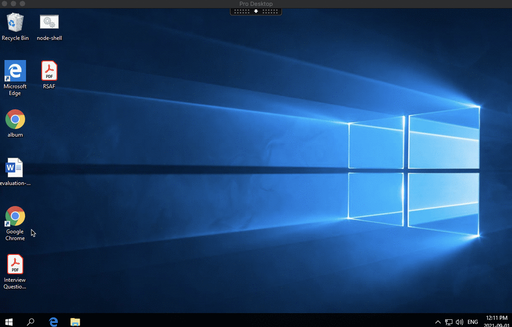
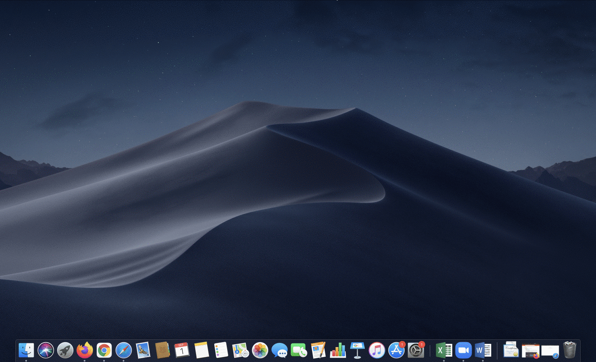

# Linux Introduction

We are going to be practicing some basic linux commands.  First, you’ll need a machine to practice some of the Linux commands you’ll be learning.  While the video tutorial uses GitHub codespaces for this purpose, we will be using a custom linux machine that I have prepared to do our work.  

You simply need to “login” to this machine via a program called SSH.  Follow the instructions below:

Login to our practice linux server, learn.operatoroverload.com, using a program called SSH.  If you are using OSX, simply start your terminal program (as seen in the demo below).  If you are using Windows, you can install PUTTY (https://www.chiark.greenend.org.uk/~sgtatham/putty/latest.html) 

Note: the user id is your school id, and password is your student number.  i.e. if you email is abc@schoolname.ca, then you would login using 

ssh abc@learn.operatoroverload.com





Follow the “ETL Challenge” section of the video class (https://www.linkedin.com/learning/command-line-data-analysis/challenge-etl).  The solution is given in the next video.

Use the technique you learned in the ETL Challenge to complete the following steps (the following are a simplified version of the ETL Challenge).  

NOTE: To complete this exercise, you will also be required to create text files in your directory.  You can create files using the nano text editor.  Watch this video the get a quick tutorial on nano (https://www.linkedin.com/learning/learning-linux-command-line-14447912/edit-text-with-nano) 

# Steps

1. Login to our github classroom and start the assignment. A new git repository
(git repo) will be created for you.

2. Clone your git repo into your home directory on the linux server under your home directory.
`git clone <assignment repo url>`

3. `cd` into your local git repo directory.  All subsequent work will be done inside this directory.

4. Use the curl command to download the one-year historical price of TSLA stock from yahoo finance.
Name this file TSLA.csv and put it in your home directory.

5. Use the sqlite3 command in the current directory (where you saved the TSLA.csv file).
Create the database (named the file tesla.db) with the following command inside the schema.sql file.

```
CREATE TABLE tesla ( Date TIMSTAMP, Open FLOAT, High FLOAT, Low FLOAT, Close FLOAT, "Adj Close" FLOAT, Volume INTEGER);
```

6. Import The TSLA.csv file into the tesla table with the following import statement inside the import.sql file:

```
.import --csv --skip 1 TSLA.csv tesla
```

7. By importing the data file into a database, you now gain the ability to run sophisticated
queries on the dataset.  For example, issue the following sqlite3 command to find out the
highest closing price for tesla within the last year:

```
select max(close) from tesla;
```

# Hand-in

1. If you have completed the tasks successfully, your git repo directory would contain the following files:

  - TSLA.csv
  - tesla.db
  - schema.sql
  - import.sql
  
2. Run the command `pytest` to run the automated tests to make sure you have done everything correctly

3. To submit the assignment, you will need to run the following commands:

  1. `git add -A` - This will add all the new files into git
  2. `git commit -a -m 'submit'` - This command will save all the files into git.
     Note: the 'submit' text is simply an arbitrary text message for you to keep track
     of what you did, you can put any text there.
  3. `git push` - This will perform the actual submission.
     It copies all your changes to github so I can see it.


